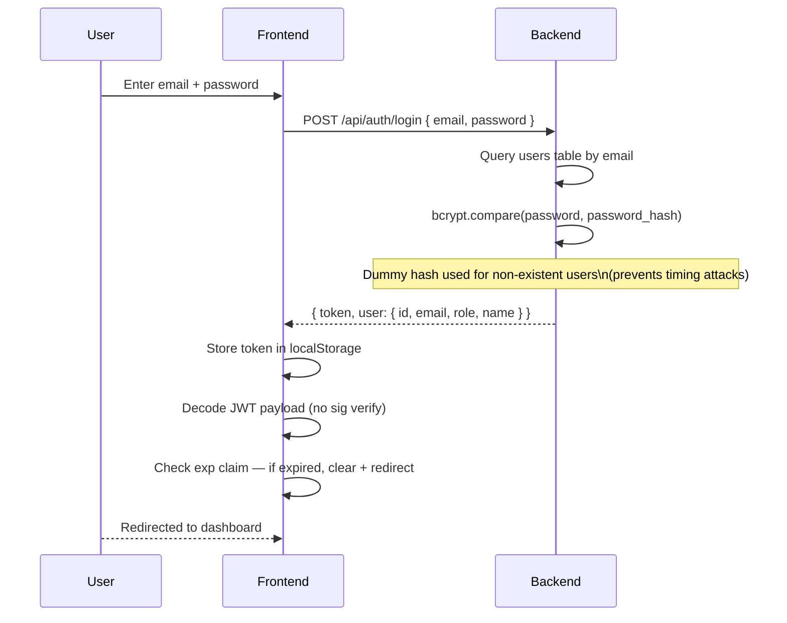
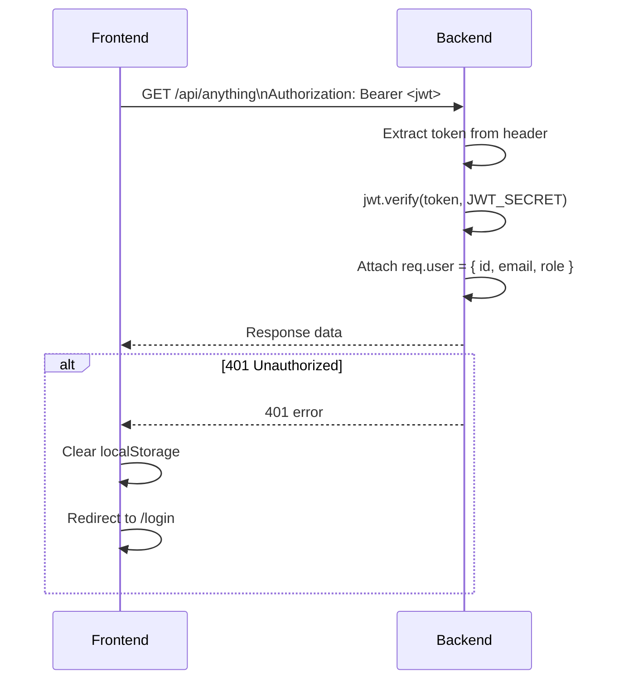
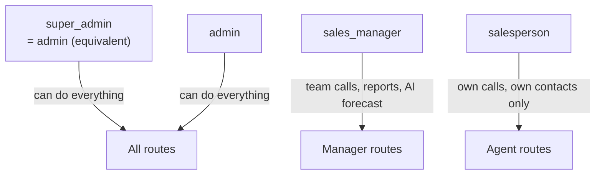
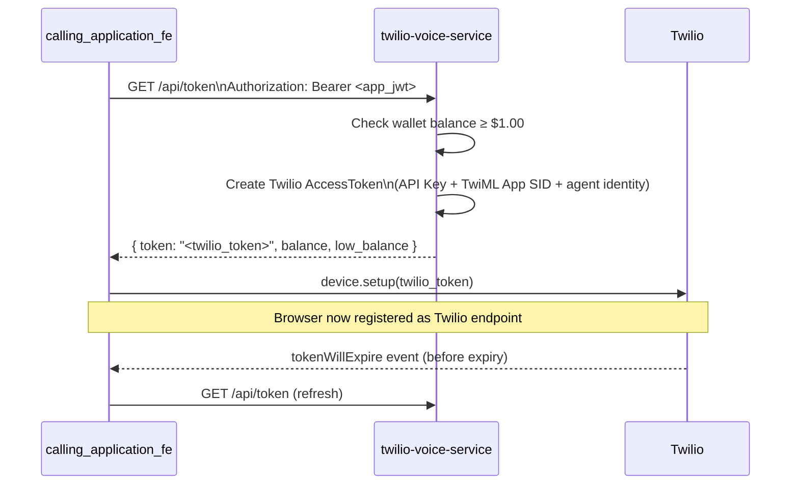

# Auth Flow

> [[00 - Index|← Back to Index]]

## Overview

All services use **JWT (JSON Web Tokens)** with Bearer token auth. There is **no single SSO** — each service has its own login and token. All services share the same `JWT_SECRET` and the same `users` table in PostgreSQL.

---

## Three Auth Systems (Today)

| Service | localStorage Key | JWT Expiry | Admin Check |
|---------|-----------------|-----------|------------|
| [[calling_application_fe]] → [[twilio-voice-service]] | `app_jwt` | 8 hours | `role === "admin"` |
| [[crm-service-next]] | `crm_token` | 12 hours | `role === "admin"` |
| [[finance-service]] → [[crm-backend]] | `finance_token` | 12 hours | `role === "admin"` only |

---

## Login Flow (Same for All Services)

---

## Every API Request

---

## Role-Based Access

### twilio-voice-service Roles

| Role | Scoped to |
|------|-----------|
| `salesperson` | Own calls + own contacts |
| `sales_manager` | Team visibility + reports |
| `admin` / `super_admin` | Everything + users, billing, phone numbers |

### crm-service-next Roles
- `admin` — full access
- Other roles — regular CRM access

### crm-backend / finance-service
- `admin` only — finance-service rejects non-admin at login

---

## Twilio Access Token (separate from auth JWT)

Used to authenticate the browser with Twilio directly (WebRTC).

---

## Security Notes

| Aspect | Detail |
|--------|--------|
| Token storage | localStorage (not httpOnly cookie — XSS risk, but standard for SPAs) |
| Password hashing | bcryptjs, 12 salt rounds |
| Timing attack prevention | Dummy hash compared even for non-existent users |
| JWT algorithm | HS256 (shared secret) |
| Rate limiting | Login endpoint: 10 attempts / 15 minutes |
| SQL injection | Parameterized queries throughout |

---

## Unification Note

In a merged app, there would be **one login, one token, one localStorage key**. The three separate auth systems exist because the services were built independently.

See [[Merge Strategy]] for how to consolidate.
