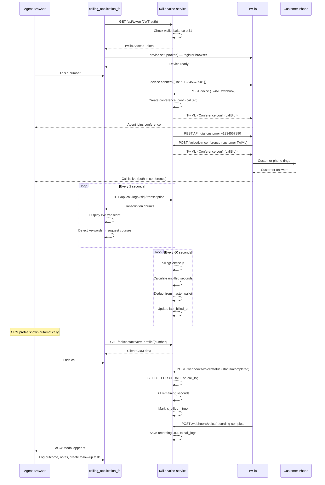
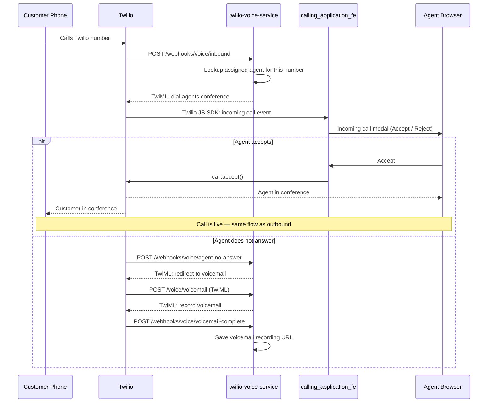
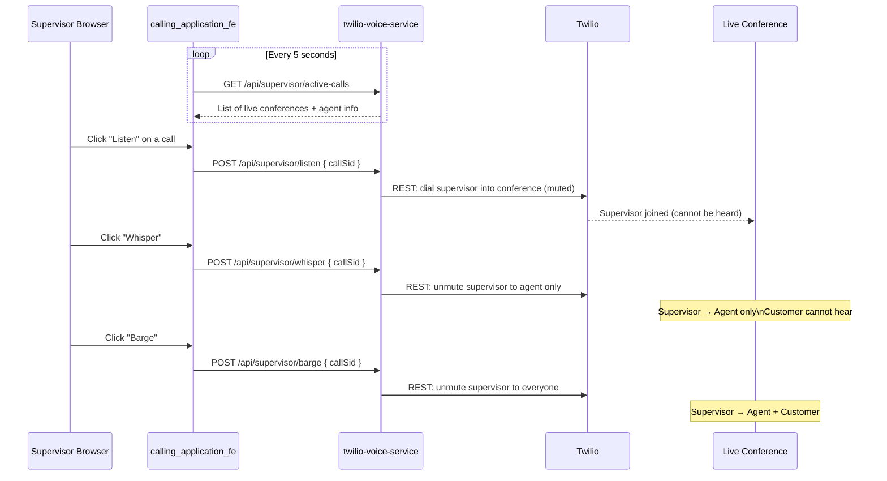

# Call Lifecycle

> [[00 - Index|← Back to Index]]

## Outbound Call — Full Flow



---

## Inbound Call — Full Flow



---

## Supervisor Monitoring Flow



---

## Conference Participant Map

```
Twilio Conference: conf_{callSid}
├── Leg 1: Agent (browser via Twilio JS SDK)
│   └── Can be: on hold (muted from conference)
├── Leg 2: Customer (PSTN phone)
│   └── Hears: agent + supervisor if barged
└── Leg 3: Supervisor (optional)
    ├── Listen mode: muted — hears everyone
    ├── Whisper mode: unmuted to agent only
    └── Barge mode: unmuted to everyone
```

---

## Billing Calculation

```
Rate example: $0.04/minute outbound

During call (every 60s):
  unbilled_seconds = NOW() - last_billed_at
  amount = CEIL((unbilled_seconds / 60) * 0.04 * 100) / 100
  → Deduct from wallet_transactions

On call end:
  final_seconds = NOW() - last_billed_at
  if not is_billed:
    Final deduction
    is_billed = true
```

**Lock mechanism:** `SELECT FOR UPDATE` on `call_logs` prevents double-billing if webhook fires twice.

---

## Real-Time Features Summary

| Feature | Mechanism | Interval |
|---------|-----------|---------|
| Live transcription | Frontend polls `/call-logs/{sid}/transcription` | Every 2s |
| Wallet balance | Frontend polls `/wallet/balance` | Every 30s |
| Active calls (supervisor) | Frontend polls `/api/supervisor/active-calls` | Every 5s |
| Billing deduction | Backend setInterval in billingService.js | Every 60s |
| Transcription delivery | Twilio POSTs to `/webhooks/voice/transcription` | Real-time |

No WebSockets anywhere — all polling or Twilio webhook callbacks.

---

## Connects To

- [[twilio-voice-service]] — the backend powering this
- [[calling_application_fe]] — the frontend UI
- [[Twilio Integration]] — Twilio APIs used
- [[Database Schema]] — call_logs, conferences, wallet_transactions
