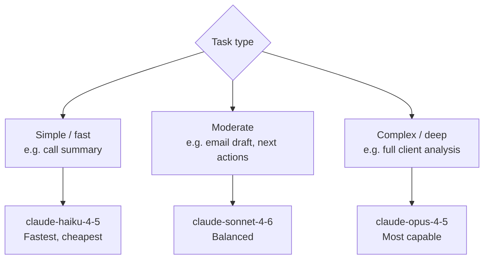

# Claude AI Features

> [[00 - Index|← Back to Index]]

## Overview

Both [[twilio-voice-service]] and [[crm-service-next]] use the **Anthropic Claude API** for AI-powered features. They use different Claude models depending on the complexity of the task.

---

## All AI Features — Master Table

| Feature | Service | Model | Max Tokens | Output |
|---------|---------|-------|-----------|--------|
| **AI Voice Agent (Lisa)** | [[twilio-voice-service]] | claude-sonnet-4-6 | 180 | Live phone conversation |
| Lead extraction (post-AI call) | [[twilio-voice-service]] | claude-haiku-4-5 | 200 | Structured JSON lead data |
| Lead scoring | [[twilio-voice-service]] | claude-sonnet-4-6 | — | Score 0-100 + reasoning |
| Lead scoring | [[crm-service-next]] | claude-opus-4-5 | 500 | Score 0-100 + reasoning |
| Next-best-action | [[twilio-voice-service]] | claude-sonnet-4-6 | — | Action list |
| Next actions (saved) | [[crm-service-next]] | claude-sonnet-4-6 | 1000 | 3-4 actions saved to DB |
| Deep client analysis | [[crm-service-next]] | claude-opus-4-5 | 1500 | Summary, risk factors, opportunity score |
| Email draft | [[twilio-voice-service]] | claude-sonnet-4-6 | — | Subject + body |
| Email draft | [[crm-service-next]] | claude-sonnet-4-6 | 800 | Subject + body |
| Pipeline forecast | [[twilio-voice-service]] | claude-sonnet-4-6 | — | Revenue forecast |
| Call summarization | [[crm-service-next]] | claude-haiku-4-5 | 400 | 3-5 bullet points |
| Course suggestion (live) | [[twilio-voice-service]] | claude-sonnet-4-6 | — | Relevant courses |

---

## Model Selection Strategy



---

## Lead Scoring

**Endpoint:** `POST /api/ai/lead-score`
**Model:** `claude-opus-4-5` | **Max tokens:** 500

**Input signals:**
- Lead status (new / contacted / qualified / converted / disqualified)
- Lead type (b2b / b2c)
- Number of calls made
- Number of notes logged
- Number of open deals
- Number of course interests

**Output (JSON):**
```json
{
  "score": 72,
  "reasoning": "Lead has been contacted 3 times, has 2 open deals..."
}
```

Score stored in `crm_clients.ai_score` for display in UI.

---

## Next Actions (crm-service-next)

**Endpoint:** `GET /api/ai/next-actions/[id]`
**Model:** `claude-sonnet-4-6` | **Max tokens:** 1000

Context built from: full client data — courses, deals, calls, notes, tasks via `buildClientContext()` in `lib/aiHelpers.js`

**Output (JSON array saved to DB):**
```json
[
  {
    "action_type": "call",
    "reasoning": "Client has not been contacted in 14 days",
    "priority": "high"
  },
  {
    "action_type": "email",
    "reasoning": "Send ITIL course proposal based on their interest",
    "priority": "medium"
  }
]
```

**Action types:** call, email, follow_up, meeting, proposal, renewal, upsell

**Persistence:** Results saved to `crm_ai_suggestions` table. Auto-deleted on each regeneration — always fresh.

---

## Deep Client Analysis

**Endpoint:** `POST /api/ai/analyze-client`
**Model:** `claude-opus-4-5` | **Max tokens:** 1500

**Output:**
```json
{
  "analysis": "This client is a high-value B2B account...",
  "next_steps": ["Schedule renewal call", "Propose PRINCE2 course"],
  "risk_factors": ["Last contact was 30 days ago", "Deal stalled"],
  "opportunity_score": 85
}
```

---

## Email Drafting

**Endpoint:** `POST /api/ai/email-draft`
**Input:** `{ clientId, purpose, additionalContext }`
**Model:** `claude-sonnet-4-6` | **Max tokens:** 800

**Output:**
```json
{
  "subject": "Following up on your ITIL 4 interest",
  "body": "Dear [Name],\n\nFollowing our call last week..."
}
```

Agent reviews, edits, then sends via the `/mail` page.

---

## Call Summarization

**Endpoint:** `POST /api/ai/summarize-call/[id]`
**Model:** `claude-haiku-4-5-20251001` (fastest/cheapest)
**Max tokens:** 400

Input: raw call transcript from `call_transcriptions` table
Output: 3-5 bullet points stored back in `call_logs.ai_summary`

Uses Haiku intentionally — summaries are simple and high volume.

---

## Live Course Suggestion (during calls)

**Endpoint:** `POST /api/knowledge/suggest`
**Triggered by:** [[calling_application_fe]] detecting keywords in live transcript

**Keyword examples:** agile, scrum, itil, devops, six sigma, pmp, prince2, cissp, cobit

**Flow:**
```
Transcript chunk arrives
    → FE scans for keywords
    → POST /api/knowledge/suggest { keywords, call_sid }
    → AI matches + ranks courses
    → Displayed in "Course Suggestions" panel in Dialer
```

---

## AI Voice Agent — Lisa

Lisa is a fully automated inbound voice assistant that handles calls when no agent is available, or when an agent manually transfers a call.

**Voice:** `Google.en-US-Chirp3-HD-Kore` (Chirp3-HD — most natural sounding, confirmed working)

**Persona:** Warm, friendly sales assistant for Invensis Learning. Uses contractions, short sentences, natural openers ("Perfect!", "Sure!"). Max 1-2 sentences per reply. Asks only one question per turn.

**Conversation flow Lisa follows:**
1. Ask what course/topic they're interested in
2. Give a one-sentence description from the course catalog
3. Let them know an expert will call back with pricing
4. Ask for their name
5. Ask for their best callback number
6. Confirm both → say exactly: "Have a great day, goodbye!"

**Course catalog** is loaded fresh from the DB (`courses` + `course_categories` tables) when the session starts. Lisa only uses courses from the catalog.

**Session management:** Per-call in-memory session (`callSid → { messages, transcript, systemPrompt }`). Messages are the full Claude conversation history. Claude API timeout: 12s (Twilio webhook timeout is 15s).

**Post-call automation:**
- Transcript saved to `call_logs.transcript`, status set to `ai-handled`
- `extractLeadInfo()` (Haiku) pulls structured data from transcript
- Lead created in `leads` table (`source = 'inbound_call'`, round-robin assigned)
- Follow-up `crm_tasks` row created for assigned agent (due in 24h)
- Activity logged in `activities` table

**Key files:**
- `controllers/aiCallController.js` — Claude conversation, lead extraction, session management
- `app.js` — TwiML routes: `/voice/ai-answer`, `/voice/ai-gather`, `/voice/ai-respond`

**Error resilience:**
- 12s Claude timeout prevents Twilio's 15s webhook timeout from triggering
- Global Express error handler returns valid TwiML (never raw 500 HTML)
- Body parser limit: 100kb (Twilio payloads can be large)

---

## Transfer to AI (Agent-Initiated)

Agents can hand off a live call to Lisa at any time.

**Triggers:**
1. **During a call** — "AI" button (sparkles icon) in the Dialer next to Mute and Hold
2. **Incoming call modal** — "Transfer to AI" button (before answering)

**Backend: `POST /voice/transfer-to-ai`**
- Looks up conference by `conference_name = room-{callSid}` OR `agent_call_sid = callSid` (handles both outbound and inbound)
- Redirects customer's call → `/voice/ai-answer`
- Redirects agent's browser call → `/voice/ai-listen/{customerCallSid}` (muted listener)
- Creates `ai_{customerCallSid}` conference DB row for supervisor dashboard

**Agent listening:**
- Agent's browser joins conference `ai_{callSid}` (muted)
- After each Claude reply, `/voice/ai-respond` announces the text via `conferences.update({ announceUrl: /voice/ai-tts?text=... })`
- Agent hears Lisa's replies. Customer's voice is NOT audible (Gather/Say limitation — requires Twilio Media Streams to fix, deferred)

**Supervisor listening:**
- Supervisor dashboard shows "Listen" + "Take Over" buttons for AI calls
- Listen → joins `ai_{callSid}` conference via `/voice/ai-supervisor-listen` (silence instead of hold music, `startConferenceOnEnter: true`)
- Take Over → ends AI session, redirects customer to a new conference with the supervisor

---

## Duplication Note

Both [[twilio-voice-service]] and [[crm-service-next]] have **overlapping AI features** (lead scoring, email drafts, next actions). This is because the two CRM modules were built independently.

In a merged app (see [[Merge Strategy]]), there would be a single AI service layer.

---

## Connects To

- [[twilio-voice-service]] — AI in calling/CRM context
- [[crm-service-next]] — AI in CRM context
- [[Call Lifecycle]] — course suggestion during live calls
- [[Merge Strategy]] — consolidation plan
