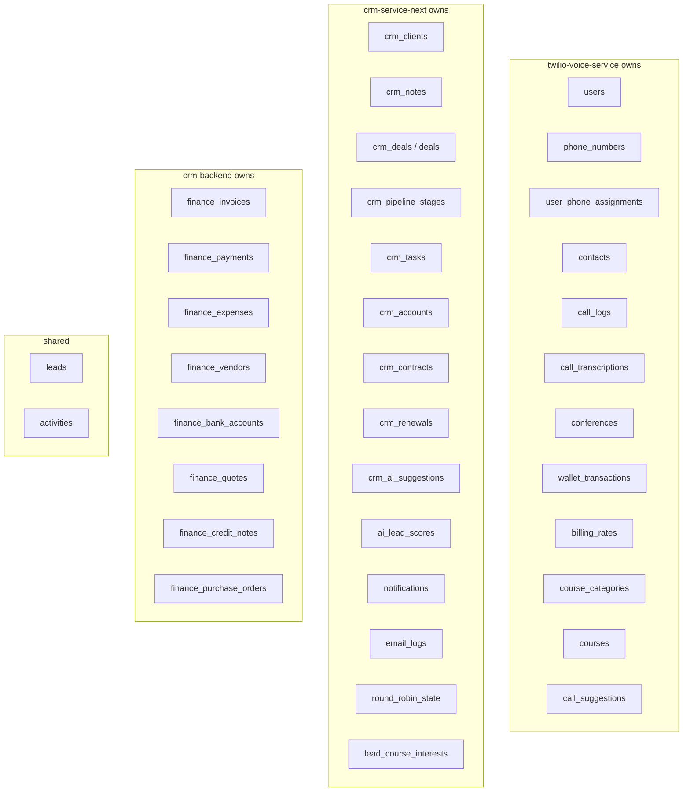
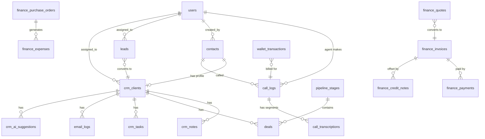

# Database Schema

> [[00 - Index|← Back to Index]]

## Overview

**All 5 services share one PostgreSQL database: `twilio_app`**

No microservice database isolation — single shared DB with clear table ownership per service.

---

## Table Ownership Map



---

## Core Tables Detail

### `users`
Shared across all services for authentication.
```
id, email, full_name, role, password_hash, is_active, created_at
```
**Roles:** salesperson, sales_manager, admin, super_admin

---

### `call_logs`
Every call made or received.
```
id, call_sid, agent_id (→users), contact_id (→contacts),
direction (inbound/outbound), status, duration_seconds,
started_at, ended_at, recording_url, ai_summary,
last_billed_at, is_billed, conference_id
```

---

### `contacts`
Phone contact records.
```
id, name, phone_number, email, company, country,
created_by (→users), created_at
```

---

### `conferences`
Active and past call conferences.
```
id, conference_name, agent_call_sid, customer_call_sid,
supervisor_call_sid, status, started_at, ended_at
```

---

### `wallet_transactions`
Append-only billing ledger.
```
id, user_id (→users), call_log_id, type (credit/debit),
amount, description, created_at
```

---

### `crm_clients`
Full CRM client profiles linked to contacts.
```
id, contact_id (→contacts), status (prospect/active/inactive/churned),
client_type (b2b/b2c), company, job_title, assigned_to (→users),
ai_score (0-100), created_at
```

---

### `leads`
Pre-conversion prospects.
```
id, name, email, phone, company, source, status,
(new/contacted/qualified/converted/disqualified),
assigned_to (→users), created_at
```
**Round-robin assignment** via `round_robin_state` table.

---

### `deals` / `crm_deals`
Sales pipeline deals.
```
id, client_id / contact_id, title, value, currency,
stage_id (→pipeline_stages), status (open/won/lost),
expected_close_date, assigned_to (→users), created_at
```

---

### `crm_ai_suggestions`
AI-generated next actions per client.
```
id, client_id, action_type, reasoning, priority, created_at
```
⚠️ Auto-deleted and regenerated each time next-actions API is called.

---

### `email_logs`
All emails (inbound + outbound).
```
id, direction, from_email, to_email, subject, body,
message_id (IMAP), client_id, sent_at, created_at
```

---

## Finance Tables

### `finance_invoices`
```
id, invoice_number (INV-YYYY-####), client_name, program_name,
issue_date, due_date, total_amount, paid_amount, subtotal,
tax_amount, status (draft/sent/paid/partial/overdue),
currency, region, line_items (JSONB), stripe_link,
quote_id (→finance_quotes), created_by (→users)
```

### `finance_payments`
```
id, payment_date, reference_number, invoice_id (→finance_invoices),
amount, method (NEFT/Wire/SWIFT/RTGS/Stripe), bank_account_region
```

### `finance_expenses`
```
id, expense_date, description, category,
vendor_id (→finance_vendors), amount, program_name,
status (pending/approved/paid), purchase_order_id (→finance_purchase_orders)
```

### `finance_quotes`
```
id, quote_number (QT-YYYY-####), client_name, program_name,
currency, subtotal, discount_type, discount_value,
tax_amount, total_amount, status (draft/sent/accepted/rejected/expired),
converted_to_invoice_id (→finance_invoices), valid_until,
line_items (JSONB)
```

---

## Key Relationships



---

## Indexes (Performance)

| Table | Indexed Columns |
|-------|----------------|
| finance_invoices | status, due_date, client_name |
| finance_expenses | status, expense_date, category |
| finance_payments | invoice_id, payment_date |
| call_logs | agent_id, status, started_at |

---

## Migration Files

| File | Location | Contents |
|------|----------|---------|
| schema.sql | twilio-voice-service/db/ | Core tables (users, contacts, calls, billing) |
| crm_schema.sql | twilio-voice-service/db/ | CRM extension (leads, accounts, deals, tasks) |
| knowledge_base.sql | twilio-voice-service/db/ | Courses, suggestions |
| finance_schema.sql | twilio-voice-service/db/ + crm-backend/migrations/ | Finance tables |
| seed.sql | both | Initial data |
