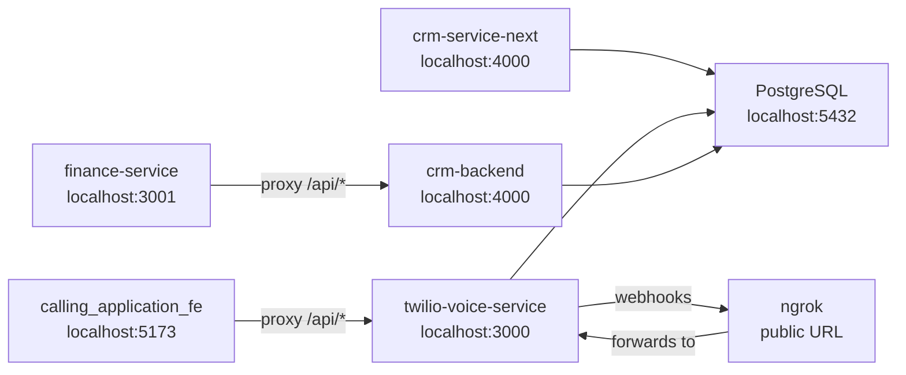

# Deployment Setup

> [[00 - Index|← Back to Index]]

## Current Production URLs

| Service | URL | Platform | Region |
|---------|-----|----------|--------|
| [[twilio-voice-service]] | Custom Render URL | Render | — |
| [[calling_application_fe]] | Vercel | Vercel | — |
| [[crm-service-next]] | crm-service-next.vercel.app | Vercel | Global |
| [[crm-backend]] | crm-backend-tlp2.onrender.com | Render | Singapore |
| [[finance-service]] | finance-service-three.vercel.app | Vercel | Global |
| PostgreSQL | Shared DB | Self-hosted / Cloud | — |

---

## Each Service — Docker & Deployment

### twilio-voice-service

```dockerfile
# Multi-stage Docker build
Stage 1: node:20-alpine
  → npm ci --only=production

Stage 2: node:20-alpine (non-root user)
  → EXPOSE 3000
  → HEALTHCHECK GET /health every 30s
  → CMD node server.js
```

Deployment: `render.yaml` (Render.com)

**Critical:** `BASE_URL` must be set to the public Render URL so Twilio webhooks work.

---

### calling_application_fe

```dockerfile
Stage 1: node:20-alpine
  → npm ci
  → npm run build → dist/

Stage 2: nginx:1.27-alpine
  → COPY dist/ to /usr/share/nginx/html
  → SPA routing (try_files $uri /index.html)
  → 1-year cache for static assets
  → gzip enabled
  → EXPOSE 5173
```

Also deploys to **Vercel** using `vercel.json`.

---

### crm-service-next

Deployed to **Vercel** (Next.js native).

No Dockerfile — Vercel auto-builds Next.js apps.

`vercel.json` configuration:
```json
{
  "outputDirectory": ".next"
}
```

**Note:** Vercel serverless functions have 10s timeout. The IMAP sync and billing loop need persistent processes — not suitable for Vercel.

---

### crm-backend

```yaml
# render.yaml
type: web
runtime: node
region: singapore
plan: free
buildCommand: npm install
startCommand: node server.js
healthCheckPath: /health

envVars:
  - key: NODE_ENV
    value: production
  - key: DATABASE_URL
    sync: false  # Set in Render dashboard
  - key: JWT_SECRET
    sync: false
  - key: ALLOWED_ORIGINS
    value: https://finance-service-three.vercel.app
```

Free tier → may have cold starts after inactivity.

---

### finance-service

```dockerfile
Stage 1: node:20-alpine
  → npm ci
  → npm run build → dist/

Stage 2: nginx:1.27-alpine
  → EXPOSE 3001
  → SPA routing
```

Also deploys to **Vercel**:
```json
{
  "outputDirectory": "dist",
  "rewrites": [
    {
      "source": "/api/:path*",
      "destination": "https://crm-backend-tlp2.onrender.com/api/:path*"
    },
    {
      "source": "/:path*",
      "destination": "/index.html"
    }
  ]
}
```

Vercel rewrites: all `/api/*` calls → Render backend. All other paths → SPA index.html.

---

## Local Development Setup



**Startup order:**
1. Start PostgreSQL
2. Start `twilio-voice-service` (port 3000)
3. Start `crm-service-next` OR `crm-backend` (both want port 4000 — pick one)
4. Start `calling_application_fe` (port 5173)
5. Start `finance-service` (port 3001)
6. Start ngrok: `ngrok http 3000` → copy URL → set as `BASE_URL` in twilio-voice-service

---

## Health Checks

| Service | Health Endpoint | What It Checks |
|---------|----------------|----------------|
| twilio-voice-service | `GET /health` | DB connectivity, uptime |
| crm-service-next | `GET /api/health` | DB connectivity, latency |
| crm-backend | `GET /health` | DB connectivity |

---

## Key Deployment Gotchas

| Issue | Detail | Fix |
|-------|--------|-----|
| Twilio webhooks need public URL | ngrok in dev, real URL in prod | Set `BASE_URL` env var |
| crm-backend free tier cold starts | Render free tier sleeps after 15min | Upgrade plan or use health check ping |
| Port 4000 conflict locally | crm-service-next + crm-backend both use 4000 | Run only one at a time, or change crm-backend to 4001 |
| IMAP sync on Vercel | Long-running connection, serverless timeout | Move to background worker |
| Billing loop on Vercel | setInterval cannot run on serverless | Move to persistent process |

---

## Connects To

- [[Environment Variables]] — all config needed
- [[Merge Strategy]] — how deployment simplifies after merge
- [[twilio-voice-service]] — backend deployment
- [[crm-backend]] — Render deployment
