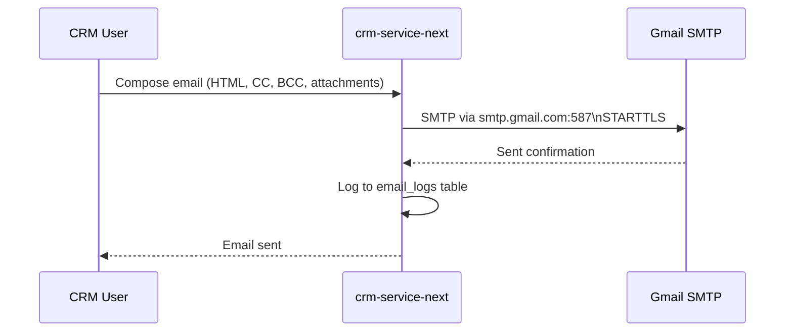
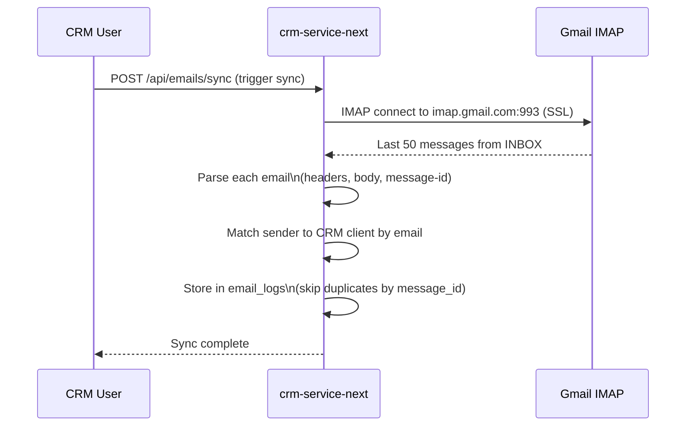

# Gmail Integration

> [[00 - Index|← Back to Index]]

## Overview

[[crm-service-next]] has a full email client built in — it can **send emails via SMTP** and **sync incoming emails via IMAP**, both using a Gmail account.

---

## Send Email (SMTP)

**Library:** nodemailer
**Endpoint:** `POST /api/mail`



**Config:**
```
SMTP_HOST=smtp.gmail.com
SMTP_PORT=587
SMTP_SECURE=false   (uses STARTTLS, not SSL)
SMTP_USER=your@gmail.com
SMTP_PASS=gmail_app_password
```

**Supports:**
- HTML body
- CC and BCC
- File attachments (via multer multipart upload)

---

## Receive / Sync Email (IMAP)

**Library:** imapflow + mailparser
**Endpoint:** `POST /api/emails/sync`



**Config:**
```
IMAP_HOST=imap.gmail.com
IMAP_PORT=993
IMAP_USER=your@gmail.com
IMAP_PASS=gmail_app_password
```

**What gets stored (email_logs table):**
```
id, direction (inbound), from_email, to_email,
subject, body (parsed text), message_id (IMAP UID),
client_id (matched CRM client), sent_at, created_at
```

---

## Gmail App Password Setup

You cannot use your regular Gmail password. You need a **Gmail App Password**:

1. Go to myaccount.google.com
2. Security → 2-Step Verification (must be enabled)
3. Security → App passwords
4. Generate one for "Mail" → use this as `SMTP_PASS` and `IMAP_PASS`

---

## Mail Page (crm-service-next /mail)

The `/mail` page in [[crm-service-next]] shows:
- Inbox — synced emails from Gmail IMAP
- Compose — rich text editor, CC/BCC, file attachments
- Email thread linked to client profile (via matched email address)
- AI email draft — pre-fill compose via [[Claude AI Features]]

---

## Limitations

| Limitation | Detail |
|-----------|--------|
| Pull-only sync | No real-time push — user manually triggers sync or scheduled |
| Last 50 emails only | IMAP sync fetches last 50 messages from INBOX |
| Single mailbox | Only one Gmail account configured (IMAP_USER) |
| No folder support | Only syncs INBOX |
| Serverless incompatible | IMAP persistent connection cannot run on Vercel serverless |

---

## Connects To

- [[crm-service-next]] — implements email features
- [[Merge Strategy]] — IMAP sync needs persistent process (cannot be serverless)
- [[Environment Variables]] — SMTP/IMAP config
