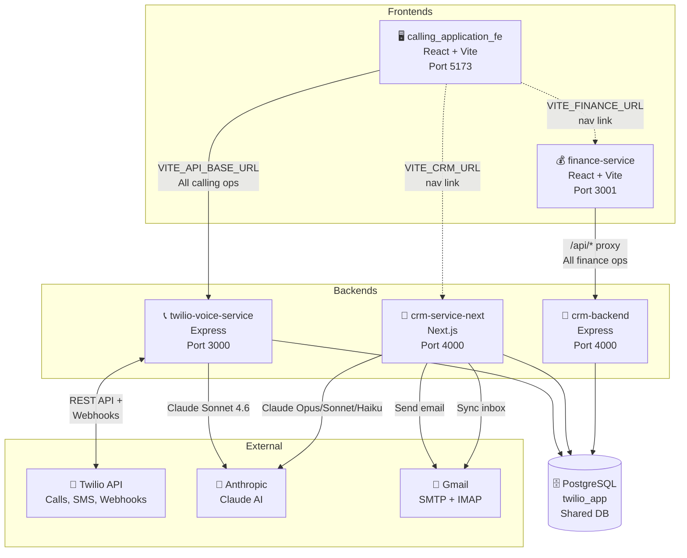
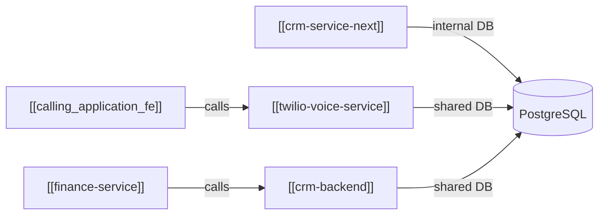

# High-Level Architecture

> [[00 - Index|← Back to Index]]

## System Architecture Diagram

---

## Services Summary

---

## Shared Database

All 5 services share **one PostgreSQL database** called `twilio_app`.

See [[Database Schema]] for full table breakdown.

---

## Key Design Decisions

| Decision | Why |
|----------|-----|
| Shared DB | Single source of truth — no sync needed between services |
| Conference-based calling | Allows supervisor listen/whisper/barge without disrupting call |
| Incremental billing every 60s | Prevents loss of revenue if call drops |
| JWT stateless auth | No session store needed; each service validates independently |
| Separate finance frontend | Finance is admin-only, isolated from agent workflow |

---

## Port Map (Local Dev)

| Service | Port |
|---------|------|
| [[twilio-voice-service]] | 3000 |
| [[calling_application_fe]] | 5173 |
| [[crm-service-next]] | 4000 |
| [[crm-backend]] | 4000 ⚠️ conflict with crm-service-next |
| [[finance-service]] | 3001 |
| PostgreSQL | 5432 |
