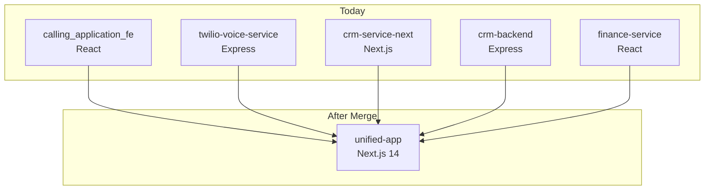

# Merge Strategy

> [[00 - Index|← Back to Index]]

## Goal

Unify all 5 repos into a **single Next.js application** that serves agents, supervisors, CRM users, and finance admins from one URL with one login.

---

## Recommended Approach: Single Next.js App



---

## Proposed File Structure

```
unified-app/
├── app/
│   ├── (auth)/
│   │   └── login/page.jsx
│   │
│   ├── (calling)/              ← from calling_application_fe
│   │   ├── dialer/page.jsx
│   │   ├── supervisor/page.jsx
│   │   ├── contacts/page.jsx
│   │   ├── history/page.jsx
│   │   ├── users/page.jsx
│   │   ├── phone-numbers/page.jsx
│   │   └── wallet/page.jsx
│   │
│   ├── (crm)/                  ← from crm-service-next
│   │   ├── clients/page.jsx
│   │   ├── leads/page.jsx
│   │   ├── pipeline/page.jsx
│   │   ├── tasks/page.jsx
│   │   ├── mail/page.jsx
│   │   ├── contracts/page.jsx
│   │   └── renewals/page.jsx
│   │
│   └── (finance)/              ← from finance-service
│       ├── invoices/page.jsx
│       ├── payments/page.jsx
│       ├── expenses/page.jsx
│       ├── vendors/page.jsx
│       ├── cashflow/page.jsx
│       ├── pl/page.jsx
│       └── tax/page.jsx
│
├── app/api/
│   ├── auth/route.js           ← unified auth
│   ├── voice/
│   │   ├── token/route.js      ← from twilio-voice-service
│   │   ├── webhooks/           ← Twilio callbacks
│   │   └── supervisor/
│   ├── crm/                    ← from crm-service-next API routes
│   ├── finance/                ← from crm-backend routes
│   └── ai/                     ← unified AI layer
│
├── services/
│   ├── db.js                   ← single DB connection
│   ├── twilio.js               ← Twilio SDK wrapper
│   ├── billing.js              ← billing loop (persistent process)
│   ├── imap.js                 ← IMAP sync (persistent process)
│   └── ai.js                   ← Claude AI wrapper
│
└── middleware.js               ← single auth middleware
```

---

## Phase-by-Phase Plan

### Phase 1 — Unify the Backends

**Goal:** One backend serving all API calls.

1. Move all `crm-backend` finance routes into `crm-service-next` as Next.js API routes
   - `/api/finance/invoices/*`
   - `/api/finance/payments/*`
   - `/api/finance/expenses/*`
   - etc.

2. Move all `twilio-voice-service` routes into `crm-service-next`
   - `/api/voice/token`
   - `/api/voice/webhooks/*`
   - `/api/supervisor/*`
   - `/api/contacts/*`
   - `/api/call-logs/*`
   - `/api/wallet/*`
   - `/api/knowledge/*`
   - `/api/v1/crm/*` (merge with existing crm routes)

3. Resolve duplicate AI implementations — keep one `services/ai.js`

4. Single `DATABASE_URL`, single `JWT_SECRET`, single auth middleware

**Result:** `crm-service-next` becomes the unified backend. `crm-backend` and `twilio-voice-service` can be retired.

---

### Phase 2 — Port the Frontends

**Goal:** All UI in one Next.js app.

1. Port `calling_application_fe` React components to Next.js pages
   - Dialer: use `"use client"` + dynamic import with `ssr: false` for Twilio JS SDK
   - Supervisor, Contacts, History, Wallet, Users, Phone Numbers

2. Port `finance-service` React pages to Next.js
   - Invoices, Payments, Expenses, Vendors, Bank Accounts, P&L, Tax, Quotes, Credit Notes, POs

3. Single sidebar with sections: Calling | CRM | Finance

4. Single login page, single JWT token

---

### Phase 3 — Cleanup

| Task | Detail |
|------|--------|
| Unify JWT expiry | Currently 8h (twilio) vs 12h (crm). Pick one. |
| Unify localStorage key | Currently: `app_jwt`, `crm_token`, `finance_token` → one key |
| Unify roles | Single role system across all features |
| Deduplicate AI | One AI service, one set of prompts |
| Audit DB tables | `pipeline_stages` vs `crm_pipeline_stages` — consolidate |
| Single .env | One environment file for everything |
| Remove port conflict | Both crm-service-next and crm-backend used port 4000 |

---

## Critical Warnings

### Twilio Webhooks Cannot Run on Serverless

Twilio POSTs to your server — Vercel serverless functions have a **10-second timeout** which may not be enough for some webhooks. Also, the billing `setInterval` loop cannot run on serverless.

**Solution:** Run the unified app on a **persistent server** (Render, Railway, VPS) — not pure Vercel serverless for the API routes that handle webhooks or background jobs.

OR: Keep a small persistent Node.js process just for webhooks + billing, and use Vercel only for frontend + non-critical API routes.

### IMAP Sync Cannot Run on Serverless

The Gmail IMAP sync (`imapflow`) is a long-running connection. It must run on a persistent process.

**Solution:** Extract to a separate background worker or use a cron trigger.

### Twilio JS SDK Must Be Client-Side Only

The `@twilio/voice-sdk` cannot run in Node.js/SSR context.

**Solution in Next.js:**
```javascript
// In your dialer page
const Dialer = dynamic(() => import("@/components/Dialer"), { ssr: false })
```

### Finance Routes Duplication

[[crm-service-next]] already has `/api/finance/*` routes internally AND [[crm-backend]] has them. During merge, pick one source of truth and delete the other.

---

## Quick Reference: What Goes Where

| Today | After Merge |
|-------|------------|
| `calling_application_fe` pages | `app/(calling)/` pages |
| `finance-service` pages | `app/(finance)/` pages |
| `twilio-voice-service` Express routes | `app/api/voice/` Next.js routes |
| `crm-backend` Express routes | `app/api/finance/` Next.js routes |
| `crm-service-next` pages | `app/(crm)/` pages (already Next.js) |
| 3 separate JWT tokens | 1 token, 1 localStorage key |
| 3 separate logins | 1 login page |
| Billing setInterval | Persistent Node.js worker or Render background job |
| IMAP sync | Persistent Node.js worker or Render background job |

---

## Connects To

- [[High-Level Architecture]] — current architecture
- [[Service Communication Map]] — current connections
- [[twilio-voice-service]] — backend to absorb
- [[crm-backend]] — backend to absorb
- [[calling_application_fe]] — frontend to absorb
- [[finance-service]] — frontend to absorb
- [[crm-service-next]] — becomes the unified app
