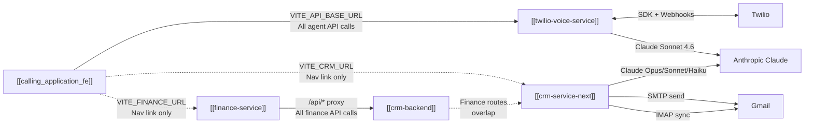

# Service Communication Map

> [[00 - Index|← Back to Index]]

## Who Calls Who

---

## calling_application_fe → twilio-voice-service

Base URL: `VITE_API_BASE_URL` (e.g., `https://your-backend.render.com`)

| What | Endpoint | When |
|------|----------|------|
| Login | `POST /api/auth/login` | App load |
| Get Twilio token | `GET /api/token` | App load + refresh |
| List contacts | `GET /api/contacts` | Contacts page |
| CRM lookup by phone | `GET /api/contacts/crm-profile/:number` | During active call |
| Call history | `GET /api/call-logs` | History page |
| Live transcription | `GET /api/call-logs/:sid/transcription` | Every 2s during call |
| Download recording | `GET /api/call-logs/:sid/recording` | History page |
| List users | `GET /api/users` | Users page |
| Wallet balance | `GET /api/wallet/balance` | Every 30s |
| Wallet history | `GET /api/wallet/history` | Wallet page |
| Wallet rates | `GET /api/wallet/rates` | Wallet page |
| Add credits | `POST /api/wallet/add-credits` | Admin action |
| Phone numbers | `GET /api/phone-numbers` | Admin page |
| Assign number | `PATCH /api/phone-numbers/:id/assign` | Admin action |
| Course suggestion | `POST /api/knowledge/suggest` | Keyword match in call |
| Active calls | `GET /api/conferences/active` | Supervisor: every 5s |
| Active call stats | `GET /api/supervisor/active-calls` | Supervisor page |
| Listen | `POST /api/supervisor/listen` | Supervisor action |
| Whisper | `POST /api/supervisor/whisper` | Supervisor action |
| Barge | `POST /api/supervisor/barge` | Supervisor action |
| Hold | `POST /api/hold` | During call |
| Unhold | `POST /api/unhold` | During call |
| End call | `POST /api/end-call` | During call |

---

## finance-service → crm-backend

Base URL: `/api/*` proxy → `https://crm-backend-tlp2.onrender.com` (prod)

| Resource | Endpoints Used |
|----------|---------------|
| Auth | `POST /api/auth/login` |
| Dashboard | `GET /api/finance/dashboard` |
| Invoices | Full CRUD + status updates |
| Payments | `GET` list + `POST` record |
| Expenses | Full CRUD + approve/reject |
| Vendors | `GET` + `POST` |
| Bank Accounts | `GET` + `POST` + `PUT` (set default) |
| Quotes | Full CRUD + convert to invoice |
| Credit Notes | Full CRUD + state machine |
| Purchase Orders | Full CRUD + mark fulfilled |
| Cashflow | `GET /api/finance/cashflow` |
| P&L | `GET /api/finance/pl` |
| Tax | `GET /api/finance/tax` |
| Aging | `GET /api/finance/invoices?status=overdue` |

---

## Twilio → twilio-voice-service (Webhooks)

Twilio POSTs to `BASE_URL` (must be public URL):

| Twilio Event | Webhook Path | Triggered When |
|-------------|-------------|----------------|
| Outbound call | `POST /voice` | Agent makes a call |
| Customer joins | `POST /voice/join-conference` | Customer picked up |
| Supervisor joins | `POST /voice/supervisor` | Supervisor connects |
| Hold music | `GET /hold-music` | Call put on hold |
| Inbound call | `POST /webhooks/voice/inbound` | Customer calls in |
| Call status update | `POST /webhooks/voice/status` | Any status change |
| Recording ready | `POST /webhooks/voice/recording-complete` | Recording processed |
| Transcription chunk | `POST /webhooks/voice/transcription` | Live speech segment |
| Agent no answer | `POST /webhooks/voice/agent-no-answer` | Agent did not pick up |
| Voicemail complete | `POST /webhooks/voice/voicemail-complete` | Customer left voicemail |
| Conference event | `POST /webhooks/conference/status` | Conference lifecycle |

**⚠️ Critical:** `BASE_URL` must be a publicly accessible URL. In dev, use **ngrok**. On Render, the service URL is used automatically.

---

## Shared Database Connections

All services connect to the same PostgreSQL DB:

| Service | Connection | Tables Used |
|---------|-----------|------------|
| [[twilio-voice-service]] | `DATABASE_URL` | users, contacts, call_logs, conferences, wallet_*, course_*, crm_* |
| [[crm-service-next]] | `DATABASE_URL` | users, crm_clients, leads, deals, tasks, email_logs, contracts, finance_* |
| [[crm-backend]] | `DATABASE_URL` | users, finance_invoices, finance_payments, finance_expenses, finance_vendors, finance_* |

---

## No Direct Service-to-Service HTTP Calls

None of the backend services call each other over HTTP. They all connect to the **same database** directly. Communication between services happens through shared DB tables.

The only "inter-service" connection is the navigation links in the frontends (VITE_CRM_URL, VITE_FINANCE_URL) which are just browser redirects, not API calls.

---

## Environment Variable → URL Mapping

| Env Var | Set In | Points To |
|---------|--------|-----------|
| `VITE_API_BASE_URL` | calling_application_fe | twilio-voice-service |
| `VITE_CRM_URL` | calling_application_fe | crm-service-next |
| `VITE_FINANCE_URL` | calling_application_fe | finance-service |
| `VITE_CRM_API_URL` | finance-service | crm-backend (dev proxy target) |
| `VITE_CRM_URL` | finance-service | crm-service-next (Back to CRM link) |
| `BASE_URL` | twilio-voice-service | itself (public URL for Twilio webhooks) |
| `FRONTEND_URL` | twilio-voice-service | calling_application_fe (CORS whitelist) |
| `NEXT_PUBLIC_CALLING_APP_URL` | crm-service-next | calling_application_fe |
| `ALLOWED_ORIGINS` | crm-backend | finance-service + crm-service-next (CORS) |
