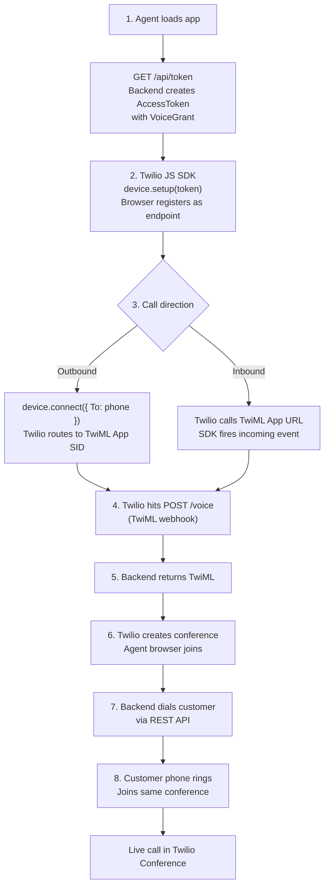
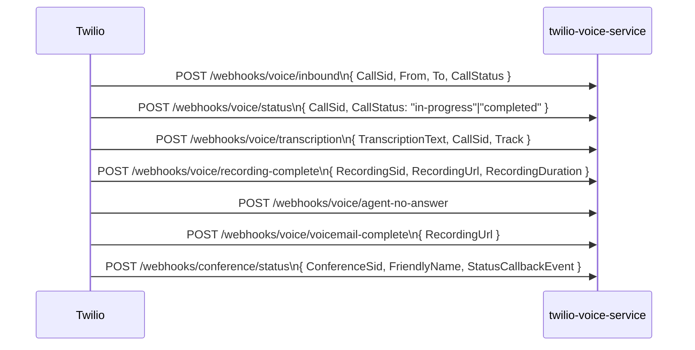
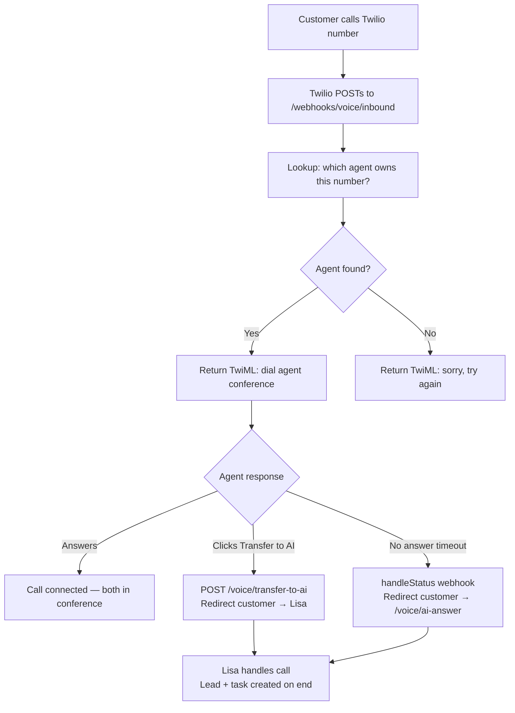

# Twilio Integration

> [[00 - Index|← Back to Index]]

## What Twilio Does In This System

Twilio provides the entire telephony layer:
- **Browser calling** (WebRTC) via Twilio JS SDK
- **PSTN dialing** (calling real phone numbers)
- **Conference management** (multi-party calls)
- **Call recording** (automatic, downloadable)
- **Live transcription** (Google engine)
- **Voicemail** (record + store)

---

## Twilio Account Resources Needed

| Resource | Env Var | Purpose |
|----------|---------|---------|
| Account SID | `TWILIO_ACCOUNT_SID` | Identity for REST API |
| Auth Token | `TWILIO_AUTH_TOKEN` | REST API authentication |
| API Key | `TWILIO_API_KEY` | Access Token generation |
| API Secret | `TWILIO_API_SECRET` | Access Token signing |
| TwiML App SID | `TWILIO_TWIML_APP_SID` | Routes browser calls to `/voice` |
| Phone Number | `TWILIO_PHONE_NUMBER` | Default outbound caller ID |

---

## How Browser Calling Works (TwiML + SDK)



---

## TwiML Responses

TwiML (Twilio Markup Language) — XML that instructs Twilio what to do:

**Outbound call (agent dials customer):**
```xml
<Response>
  <Dial>
    <Conference name="conf_{callSid}"
                startConferenceOnEnter="true"
                endConferenceOnExit="true"
                record="record-from-start"
                transcribe="true">
    </Conference>
  </Dial>
</Response>
```

**Voicemail:**
```xml
<Response>
  <Say>Please leave a message after the beep.</Say>
  <Record maxLength="120" action="/webhooks/voice/voicemail-complete"/>
</Response>
```

**Hold music:**
```xml
<Response>
  <Play loop="0">https://your-server.com/hold-music</Play>
</Response>
```

---

## Conference API (Supervisor Controls)

Once a conference exists, [[twilio-voice-service]] uses the Twilio REST API to control participants:

| Action | Twilio REST Call |
|--------|-----------------|
| Put on hold | `PATCH /conferences/{conf}/participants/{callSid}` `{ muted: true }` + play hold music |
| Unhold | `PATCH /conferences/{conf}/participants/{callSid}` `{ muted: false }` + stop hold music |
| Supervisor listen | Dial supervisor into conference with `muted: true` |
| Supervisor whisper | `PATCH` to unmute supervisor, update customer leg to hear only agent |
| Supervisor barge | `PATCH` to unmute supervisor for all participants |
| End call | `DELETE /conferences/{conf}/participants/{callSid}` |

---

## Webhooks

Twilio sends HTTP POST callbacks to `BASE_URL` for all events:



**Webhook Signature Validation:** All webhook handlers validate `X-Twilio-Signature` header to ensure the request came from Twilio and not a third party.

---

## Transcription

Twilio handles transcription via **Google Speech engine**:
- Each speech segment → `POST /webhooks/voice/transcription`
- Stored in `call_transcriptions` table with: `track` (inbound/outbound), `transcript`, `confidence`, `sequence_number`
- Frontend polls `GET /api/call-logs/{sid}/transcription` every 2 seconds
- Keywords detected client-side → trigger course suggestion AI call

---

## Recording

- Recordings start automatically (`record="record-from-start"` in TwiML)
- When complete → Twilio POSTs to `/webhooks/voice/recording-complete`
- Recording URL stored in `call_logs.recording_url`
- Download: `GET /api/call-logs/{sid}/recording` → backend proxies audio from Twilio (authenticated URL)

---

## Inbound Call Routing



---

## AI Call Routing (Lisa)

When a call is routed to Lisa, Twilio uses the existing call leg — no new call is created:

```
calls(customerCallSid).update({ url: BASE_URL + '/voice/ai-answer' })
```

This redirects the customer's in-progress call to a new TwiML document. The AI flow then runs as a Gather → Respond loop on that same call leg.

**Conference for monitoring:** A conference row `ai_{customerCallSid}` is created in the DB and as a real Twilio conference. Agents/supervisors can join it muted to hear Lisa's replies via `announceUrl`.

---

## Phone Number Assignment

Multiple agents can share one Twilio phone number:
- `phone_numbers` table — stores Twilio numbers
- `user_phone_assignments` table — maps agents to numbers (many-to-one)
- On inbound call: lookup which agent to route to based on the called number

---

## Connects To

- [[twilio-voice-service]] — implements all Twilio logic
- [[calling_application_fe]] — uses Twilio JS SDK in browser
- [[Call Lifecycle]] — full call flow using Twilio
- [[Database Schema]] — call_logs, conferences, call_transcriptions tables
