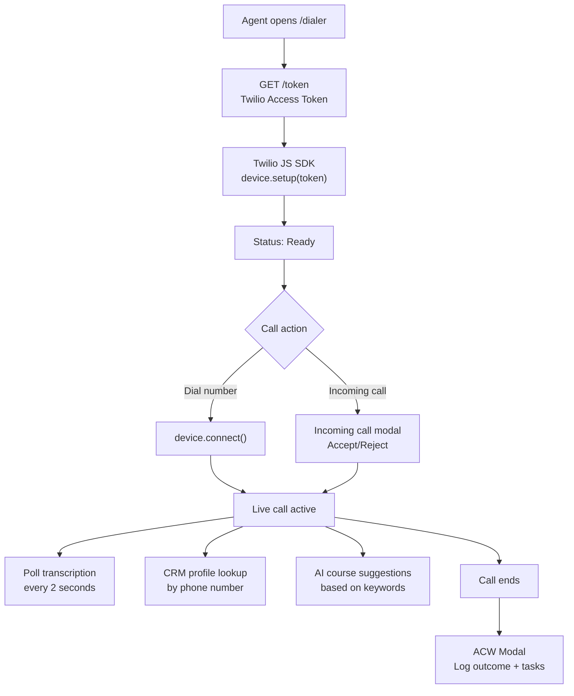

# calling_application_fe

> [[00 - Index|← Back to Index]]  
> **Type:** React 19 + Vite Frontend  
> **Port:** 5173  
> **Deployed:** Vercel / Docker + Nginx  

---

## What It Does

The **main interface that agents use every day** to:
- Make and receive calls directly from the browser (WebRTC via Twilio JS SDK)
- See live transcription during calls
- View CRM profile of the caller automatically
- Get AI-powered course suggestions based on what the customer says
- Monitor and coach live calls (Supervisor mode)
- Manage contacts, call history, wallet, team

---

## Tech Stack

| Layer | Technology |
|-------|-----------|
| Framework | React 19 |
| Build | Vite 8 |
| Routing | React Router DOM 7 |
| Styling | Tailwind CSS |
| Icons | Lucide React |
| Charts | Recharts |
| Calling | @twilio/voice-sdk 2.18 (WebRTC) |
| Deploy | Docker + Nginx / Vercel |

---

## Pages & Routes

| Route | Page | Who Can Access |
|-------|------|---------------|
| `/login` | Login | Public |
| `/dashboard` | Stats overview, recent calls | All agents |
| `/dialer` | Make/receive calls, transcription, CRM panel | All agents |
| `/contacts` | Contact list, CRUD, tags | All agents |
| `/history` | Call logs, recordings, transcripts | All agents |
| `/phone-numbers` | Assign Twilio numbers | Admin only |
| `/users` | Team roster | Admin only |
| `/wallet` | Billing, add credits, set rates | Admin only |
| `/supervisor` | Monitor live calls — listen/whisper/barge | Admin only |

---

## Dialer — The Core Feature



**Keyword detection for course suggestions:**
Agile, Scrum, ITIL, DevOps, Six Sigma, PMP, PRINCE2, CISSP, etc.

**Call controls during an active call (Mute / Hold / AI):**
- **Mute** — toggle mic
- **Hold** — put customer on hold
- **AI** (sparkles icon) — transfer call to Lisa; button turns purple showing "Listening" while agent monitors Lisa's replies

**Incoming call modal options (Accept / Transfer to AI / Reject):**
- **Accept** — join the call normally
- **Transfer to AI** — hand call to Lisa immediately without answering; agent's ringing call is rejected
- **Reject** — reject the call

---

## External Service Connections

| Service | Env Var | What Its Used For |
|---------|---------|-------------------|
| [[twilio-voice-service]] | `VITE_API_BASE_URL` | Auth, token, contacts, history, wallet, supervisor |
| [[crm-service-next]] | `VITE_CRM_URL` | Navigation link to CRM |
| [[finance-service]] | `VITE_FINANCE_URL` | Navigation link to Finance |

---

## API Calls Made (to twilio-voice-service)

| Endpoint | When |
|----------|------|
| `POST /api/auth/login` | Login |
| `GET /api/token` | App load + token refresh |
| `GET /api/contacts` | Contacts page |
| `GET /api/contacts/crm-profile/:number` | During active call |
| `GET /api/call-logs` | History page |
| `GET /api/call-logs/:sid/transcription` | Every 2s during call |
| `GET /api/call-logs/:sid/recording` | Play recording |
| `GET /api/users` | Users page |
| `GET /api/wallet/balance` | Every 30s |
| `POST /api/knowledge/suggest` | Keyword match during call |
| `GET /api/conferences/active` | Supervisor: every 5s |
| `POST /api/supervisor/listen` | Supervisor action |
| `POST /api/supervisor/whisper` | Supervisor action |
| `POST /api/supervisor/barge` | Supervisor action |
| `POST /api/supervisor/takeover` | Supervisor: take over AI call |
| `POST /voice/transfer-to-ai` | Agent: transfer active/incoming call to Lisa |

---

## State Management

| Context | What It Manages |
|---------|----------------|
| `AuthContext` | JWT token, user info, login/logout, `authFetch` wrapper |
| `TwilioContext` | Device, call state, duration, incoming calls |
| `ContactsContext` | Contacts list, tags, phone lookup |
| `WalletContext` | Balance, history, rates |

---

## Auth

- Token stored in `localStorage` key: `app_jwt`
- All API calls: `Authorization: Bearer <token>`
- On 401: auto-logout + redirect to `/login`
- Token auto-refreshed via Twilio SDK `tokenWillExpire` event

---

## Real-time Polling

| Data | Interval |
|------|----------|
| Live transcription | Every 2 seconds |
| Wallet balance | Every 30 seconds |
| Active calls (supervisor) | Every 5 seconds |

No WebSockets — all polling.

---

## Docker / Deployment

```
Stage 1: Node 20 Alpine → npm ci → npm run build → dist/
Stage 2: Nginx 1.27 Alpine → serve dist/ → SPA routing
Exposed port: 5173
Health check: wget http://localhost:5173/
```

Nginx config: SPA fallback (`try_files $uri /index.html`), 1-year cache for static assets, gzip.

---

## Connects To

- [[twilio-voice-service]] — all backend API calls
- [[crm-service-next]] — navigation link
- [[finance-service]] — navigation link
- [[Twilio Integration]] — browser WebRTC SDK
- [[Auth Flow]] — JWT login flow
