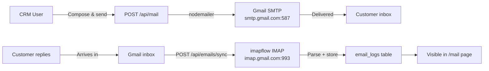

# crm-service-next

> [[00 - Index|← Back to Index]]  
> **Type:** Next.js 14 Full-Stack App  
> **Port:** 4000  
> **Deployed:** Vercel  

---

## What It Does

The **CRM platform** for managing the full sales lifecycle:
- Clients, leads, deals, pipeline (Kanban)
- Full email client (send via SMTP, sync inbox via IMAP — Gmail)
- Contract lifecycle management with multi-currency support
- AI-powered: lead scoring, client analysis, next actions, email drafting, call summaries
- Tasks and activity timeline per client
- Finance routes (invoices, payments, expenses) — mirrored from [[crm-backend]]

---

## Tech Stack

| Layer | Technology |
|-------|-----------|
| Framework | Next.js 14 (App Router, React 18) |
| Database | PostgreSQL via `pg` driver (raw SQL) |
| Auth | JWT (HS256, 12h expiry) |
| AI | Anthropic Claude (Opus/Sonnet/Haiku) |
| Email Send | nodemailer (Gmail SMTP) |
| Email Receive | imapflow + mailparser (Gmail IMAP) |
| File Uploads | multer |
| Deploy | Vercel |

---

## Pages

| Route | Purpose |
|-------|---------|
| `/login` | Authentication |
| `/` | Dashboard — KPIs, recent calls, overdue tasks, AI next actions |
| `/clients` | Client list with AI scores |
| `/clients/[id]` | Client detail, notes, timeline, deals, tasks |
| `/leads` | MQL/SQL pipeline with AI scoring (0-100) |
| `/opportunities` | Open deals with filters |
| `/pipeline` | Kanban board — drag deals between stages |
| `/contracts` | Contract lifecycle (draft → sent → signed) |
| `/tasks` | Team task management |
| `/mail` | Full email client — compose, inbox, attachments |
| `/renewals` | Contract renewal tracking |
| `/mqls` | Marketing Qualified Leads view |
| `/sqls` | Sales Qualified Leads view |
| `/settings` | Admin — user management |

---

## API Routes (50+ endpoints)

### Auth
- `POST /api/auth/login` — Login → JWT (12h)
- `GET /api/auth/me` — Current user

### Clients
- `GET/POST /api/clients` — List (paginated, filtered) / Create
- `GET/PUT/DELETE /api/clients/[id]` — CRUD
- `GET/POST /api/clients/[id]/notes` — Notes
- `GET /api/clients/[id]/timeline` — Activity log
- `GET /api/clients/[id]/deals` — Linked deals
- `GET /api/clients/[id]/tasks` — Linked tasks
- `GET/POST /api/clients/[id]/courses` — Course interests

### Leads
- `GET/POST /api/leads` — List / Create (with round-robin assignment)
- `GET/PATCH/DELETE /api/leads/[id]` — CRUD

### Pipeline & Deals
- `GET /api/pipeline` — Stages + deals (by pipeline type: b2b/b2c)
- `POST /api/pipeline/deals` — Create deal
- `GET/PUT /api/pipeline/deals/[id]` — Get / update (stage, won/lost)
- `GET /api/pipeline/stages` — All stages

### Tasks
- `GET/POST /api/tasks` — List / Create
- `GET/PUT/PATCH/DELETE /api/tasks/[id]` — CRUD

### Email
- `GET/POST /api/emails` — List / Log email
- `POST /api/emails/sync` — Trigger IMAP sync (pulls last 50 from Gmail)
- `POST /api/mail` — Send email via SMTP (HTML, CC, BCC, attachments)

### AI Features
- `POST /api/ai/lead-score` — Score 0-100 (Claude Opus 4.5)
- `POST /api/ai/analyze-client` — Deep analysis (Claude Opus 4.5)
- `GET /api/ai/next-actions/[id]` — 3-4 next actions (Claude Sonnet 4.6)
- `POST /api/ai/email-draft` — Draft email (Claude Sonnet 4.6)
- `POST /api/ai/summarize-call/[id]` — 3-5 bullet summary (Claude Haiku 4.5)

### Finance (mirrors crm-backend)
- `/api/finance/invoices/*`
- `/api/finance/payments/*`
- `/api/finance/expenses/*`
- `/api/finance/vendors/*`
- `/api/finance/quotes/*`
- `/api/finance/cashflow`
- `/api/finance/pl`
- `/api/finance/tax`
- `/api/finance/dashboard`

### Contracts & Renewals
- `GET/POST /api/contracts` — List / Create (auto-email signatory)
- `GET/PUT/DELETE /api/contracts/[id]` — CRUD

### Reports & Dashboard
- `GET /api/dashboard` — KPIs (clients, calls, deals, pipeline value)
- `GET /api/revenue` — Revenue reporting
- `GET /api/mqls` — MQL funnel
- `GET /api/sqls` — SQL funnel

---

## AI Models Used

| Feature | Model | Max Tokens |
|---------|-------|-----------|
| Lead scoring | claude-opus-4-5 | 500 |
| Deep client analysis | claude-opus-4-5 | 1500 |
| Next actions (saved to DB) | claude-sonnet-4-6 | 1000 |
| Email drafting | claude-sonnet-4-6 | 800 |
| Call summarization | claude-haiku-4-5 | 400 |

See [[Claude AI Features]] for full details.

---

## Email System

---

## Multi-Currency Contracts

Supported currencies with GBP as base:

| Currency | Rate to GBP |
|----------|------------|
| GBP | 1.0 |
| USD | 1.2741 |
| EUR | 1.1682 |
| SGD | 0.5881 |
| INR | 0.00941 |

---

## Auth

- Token stored in `localStorage` key: `crm_token`
- User stored in: `crm_user`
- JWT expires: 12 hours
- Admin check: `user.role === "admin"`

---

## Environment Variables

Key vars:
- `DATABASE_URL` — Shared PostgreSQL (`twilio_app`)
- `JWT_SECRET` — Same secret as other services
- `ANTHROPIC_API_KEY` — Claude API
- `SMTP_USER/SMTP_PASS` — Gmail app password
- `IMAP_USER/IMAP_PASS` — Gmail IMAP password
- `NEXT_PUBLIC_CALLING_APP_URL` — Link to [[calling_application_fe]]

See [[Environment Variables]] for full list.

---

## Connects To

- [[crm-backend]] — Finance routes overlap
- [[Database Schema]] — CRM tables
- [[Claude AI Features]] — AI feature details
- [[Gmail Integration]] — Email send/sync
- [[calling_application_fe]] — Navigation link back
- [[Auth Flow]] — JWT auth details
