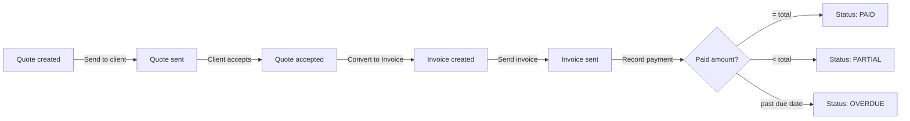
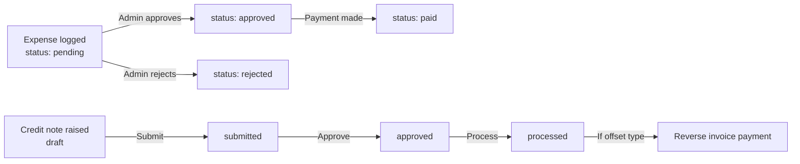

# finance-service

> [[00 - Index|← Back to Index]]  
> **Type:** React + Vite Frontend  
> **Port:** 3001  
> **Deployed:** Vercel (`finance-service-three.vercel.app`)  

---

## What It Does

An **admin-only finance dashboard** for managing all financial operations of Invensis Learning. It is a pure frontend — all data comes from [[crm-backend]].

---

## Tech Stack

| Layer | Technology |
|-------|-----------|
| Framework | React 18 |
| Build | Vite 5 |
| Routing | React Router DOM 6 |
| HTTP Client | Axios |
| Styling | Custom CSS (dark navy theme) |
| Fonts | DM Sans, DM Mono, Playfair Display |
| Deploy | Docker + Nginx / Vercel |

---

## Pages

| Route | Purpose |
|-------|---------|
| `/login` | Admin authentication |
| `/` | Dashboard — KPIs, recent invoices, cash flow chart |
| `/invoices` | Invoice list — create, send, preview, record payment |
| `/payments` | Payment ledger — record incoming payments |
| `/aging` | A/R aging buckets — overdue analysis |
| `/expenses` | Expense log — approve/reject pending |
| `/vendors` | Vendor directory |
| `/bankaccounts` | Regional bank accounts — set default |
| `/pl` | P&L statement (monthly/quarterly/annual) |
| `/cashflow` | Monthly cash flow chart + running balance |
| `/tax` | GST + TDS summary |
| `/quotes` | Quotes — create, send, convert to invoice |
| `/credit-notes` | Refunds and invoice offsets |
| `/purchase-orders` | Vendor POs — track delivery |

---

## Connection to Backend

All API calls go to [[crm-backend]] via:
- **Dev:** Vite proxy `/api/*` → `http://localhost:4000`
- **Prod (Vercel):** Rewrites `/api/:path*` → `https://crm-backend-tlp2.onrender.com/api/:path*`

---

## Auth

- Login: `POST /api/auth/login`
- Token stored in `localStorage` key: `finance_token`
- User stored in: `finance_user`
- Only `role === "admin"` users can log in
- Axios interceptor auto-adds `Authorization: Bearer <token>`
- On 401: clear localStorage → redirect to `/login`

**Sidebar navigation** includes a "Back to CRM" link → [[crm-service-next]]

---

## Multi-Region Support

Supports 6 regions with auto-currency and tax selection:

| Region | Currency | Tax |
|--------|----------|-----|
| India | INR ₹ | GST 18% |
| US | USD $ | Zero-rated |
| UK | GBP £ | VAT 20% |
| Europe | EUR € | VAT 19% |
| Singapore | SGD S$ | GST 9% |
| Australia | AUD A$ | GST 10% |

When creating an invoice, selecting a client auto-selects their region, currency, tax rate, and default bank account.

---

## Key Finance Workflows

---

## Invoice Preview

Each invoice preview shows:
- Line items with quantities, unit price, subtotal
- Tax amount (based on region)
- Total amount in local currency
- Regional bank account details for payment
- Stripe payment link (if configured)

---

## Connects To

- [[crm-backend]] — all API calls
- [[crm-service-next]] — "Back to CRM" navigation link
- [[Environment Variables]] — config
- [[Database Schema]] — finance tables (via crm-backend)
