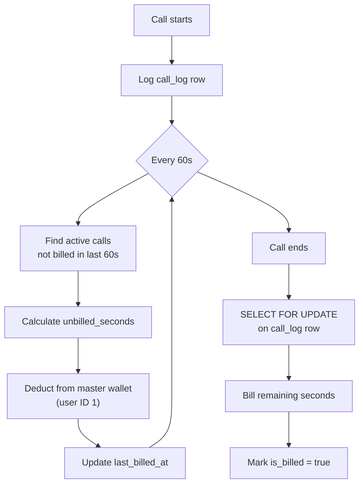
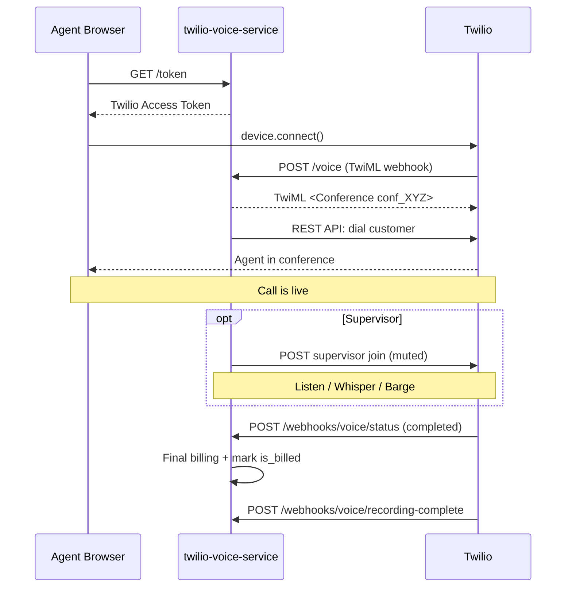

# twilio-voice-service

> [[00 - Index|← Back to Index]]  
> **Type:** Node.js / Express Backend  
> **Port:** 3000  
> **Deployed:** Render / Docker  

---

## What It Does

This is the **core calling engine** of the entire platform. It:
- Powers all browser-to-phone and phone-to-browser calls using Twilio
- Manages call conferences (agent + customer + optional supervisor)
- Handles live transcription, call recording, voicemail
- Runs the **incremental billing system** (charges every 60 seconds)
- Has a built-in **CRM module** (leads, accounts, deals, tasks, pipeline)
- Has a built-in **knowledge base** (training courses + AI suggestions during calls)
- Uses **Claude AI** for lead scoring, next-best-action, email drafts, pipeline forecast

---

## Tech Stack

| Layer | Technology |
|-------|-----------|
| Runtime | Node.js 20 |
| Framework | Express.js 5.2 |
| Database | PostgreSQL (raw SQL, no ORM) |
| Auth | JWT (HS256, 8h expiry) |
| Calling | Twilio SDK |
| AI | Anthropic Claude Sonnet 4.6 |
| Deploy | Docker + Render |

---

## API Routes

### Auth
| Method | Path | Purpose |
|--------|------|---------|
| POST | `/auth/login` | Login → JWT (rate limited: 10/15min) |

### Calling Core
| Method | Path | Auth | Purpose |
|--------|------|------|---------|
| GET | `/token` | JWT | Get Twilio Access Token for WebRTC |
| POST | `/hold` | JWT | Put call on hold |
| POST | `/unhold` | JWT | Resume held call |
| POST | `/end-call` | JWT | Hang up |
| ALL | `/voice` | Twilio | TwiML outbound call handler |
| ALL | `/voice/join-conference` | Twilio | Customer/supervisor join TwiML |
| GET | `/hold-music` | Twilio | Hold music stream |
| ALL | `/voice/voicemail` | Twilio | Voicemail TwiML |
| ALL | `/voice/supervisor` | Twilio | Supervisor joins conference (muted) |
| GET | `/voice/silence` | Twilio | Silent waitUrl — suppresses hold music |

### AI Voice Agent (Lisa)
| Method | Path | Auth | Purpose |
|--------|------|------|---------|
| POST | `/voice/transfer-to-ai` | JWT | Agent transfers live call to Lisa |
| ALL | `/voice/ai-answer` | Twilio | Greet customer, start AI loop |
| ALL | `/voice/ai-gather` | Twilio | Gather customer speech |
| ALL | `/voice/ai-respond` | Twilio | Claude reply → Say → loop |
| ALL | `/voice/ai-listen/:callSid` | Twilio | Agent joins ai_ conference as muted listener |
| ALL | `/voice/ai-supervisor-listen` | Twilio | Supervisor joins ai_ conference (no hold music) |
| GET | `/voice/ai-tts` | Twilio | TTS helper for conference announceUrl |

### Webhooks (Twilio → this service)
| Method | Path | Purpose |
|--------|------|---------|
| POST | `/webhooks/voice/inbound` | Incoming call handler |
| POST | `/webhooks/voice/status` | Call status updates |
| POST | `/webhooks/voice/recording-complete` | Save recording URL |
| POST | `/webhooks/voice/transcription` | Live transcription chunks |
| POST | `/webhooks/voice/agent-no-answer` | Route to voicemail |
| POST | `/webhooks/voice/voicemail-complete` | Save voicemail |
| POST | `/webhooks/conference/status` | Conference lifecycle events |

### Call Logs
| Method | Path | Purpose |
|--------|------|---------|
| GET | `/call-logs` | List (admin=all, agent=own) |
| GET | `/call-logs/:id` | Call details |
| GET | `/call-logs/:sid/recording` | Download MP3 |
| GET | `/call-logs/:sid/transcription` | Get transcription |

### Contacts
| Method | Path | Purpose |
|--------|------|---------|
| GET | `/contacts` | List contacts |
| POST | `/contacts` | Create contact |
| GET | `/contacts/crm-profile/:number` | Lookup by phone (used during calls) |
| GET/PATCH/DELETE | `/contacts/:id` | CRUD |

### Supervisor Controls
| Method | Path | Auth | Purpose |
|--------|------|------|---------|
| GET | `/api/supervisor/active-calls` | Admin | Live conferences list (includes AI calls) |
| GET | `/api/supervisor/stats` | Admin | Team performance |
| POST | `/api/supervisor/listen` | Admin | Join muted (uses silence URL for AI calls) |
| POST | `/api/supervisor/whisper` | Admin | Coach agent only |
| POST | `/api/supervisor/barge` | Admin | Join unmuted (all hear) |
| POST | `/api/supervisor/takeover` | Admin | End AI session, join call directly |

### Wallet / Billing
| Method | Path | Purpose |
|--------|------|---------|
| GET | `/wallet/balance` | Master wallet balance |
| GET | `/wallet/history` | Transaction ledger |
| GET | `/wallet/rates` | Per-minute rates |
| POST | `/wallet/add-credits` | Add credits (admin) |
| PATCH | `/wallet/rates` | Update rates (admin) |

### Knowledge Base
| Method | Path | Purpose |
|--------|------|---------|
| GET | `/knowledge/categories` | Course categories |
| GET | `/knowledge/courses` | Course list |
| GET | `/knowledge/courses/search` | Full-text search |
| POST | `/knowledge/suggest` | AI course suggestion during call |

### CRM (built-in)
| Resource | Base Path |
|----------|-----------|
| Leads | `/api/v1/crm/leads` |
| Accounts | `/api/v1/crm/accounts` |
| Deals | `/api/v1/crm/deals` |
| Tasks | `/api/v1/crm/tasks` |
| Activities | `/api/v1/crm/activities` |
| AI Features | `/api/v1/crm/ai/*` |
| Reports | `/api/v1/crm/reports/*` |
| Notifications | `/api/v1/crm/notifications` |

### Users & Phone Numbers (Admin only)
| Resource | Base Path |
|----------|-----------|
| Users | `/users` |
| Phone Numbers | `/phone-numbers` |

---

## AI Voice Agent — Lisa

Lisa is an inbound AI sales assistant that handles calls when no agent is available, or when an agent manually transfers.

**Voice:** `Google.en-US-Chirp3-HD-Kore`  
**Model:** `claude-sonnet-4-6` (180 max tokens per reply, 12s timeout)  
**Lead extraction:** `claude-haiku-4-5` (after call ends)

**How it's triggered:**
1. Agent no-answer → `handleStatus` webhook redirects customer to `/voice/ai-answer`
2. Agent clicks "AI" button in Dialer during an active call
3. Agent clicks "Transfer to AI" in the incoming call modal

**Post-call:** Transcript saved → Haiku extracts lead info → lead created in DB → follow-up `crm_tasks` created (round-robin assigned, due in 24h)

**Listening:** Agent/supervisor can listen to Lisa's replies via the `ai_{callSid}` conference. Supervisor dashboard shows "Listen" + "Take Over" buttons for AI calls.

**Key constraint:** Customer's voice is NOT audible to listeners (Gather/Say architecture). Full two-way monitoring requires Twilio Media Streams (not yet implemented).

See [[Claude AI Features]] for full details.

---

## Billing System

**Balance check:** Before every call, checks master wallet ≥ $1.00. Shows `low_balance` warning if < $10.00.

---

## Conference Architecture

---

## Roles

| Role | Access |
|------|--------|
| `salesperson` | Own calls, own contacts, dial |
| `sales_manager` | Team calls, reports, AI forecast |
| `admin` / `super_admin` | Everything + users, billing, phone numbers |

---

## Environment Variables

See [[Environment Variables]] for full list.

Key vars:
- `TWILIO_ACCOUNT_SID`, `TWILIO_AUTH_TOKEN` — Twilio REST auth
- `TWILIO_API_KEY`, `TWILIO_API_SECRET` — Access token signing
- `TWILIO_TWIML_APP_SID` — Routes browser calls to `/voice`
- `BASE_URL` — **Must be public URL** for Twilio webhooks (ngrok in dev)
- `DATABASE_URL` — Shared PostgreSQL connection
- `JWT_SECRET` — Shared with other services
- `ANTHROPIC_API_KEY` — Claude AI

---

## Connects To

- [[Twilio Integration]] — calling, conferences, webhooks
- [[Claude AI Features]] — CRM AI features
- [[calling_application_fe]] — frontend that consumes this API
- [[Database Schema]] — tables owned by this service
